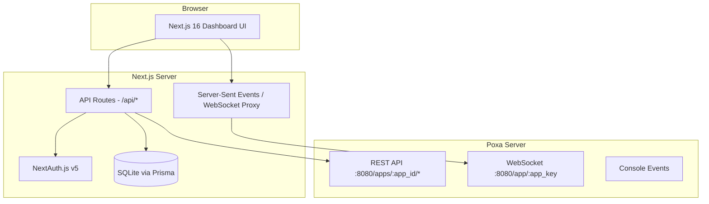

# Enterprise-Grade Pusher Dashboard (Poxa)

A comprehensive Next.js 16 dashboard for managing and monitoring a self-hosted [Poxa](https://github.com/edgurgel/poxa) Pusher server. This dashboard provides the same premium experience as the official Pusher dashboard — but for your own infrastructure.

---

## Background & Context

**Poxa** is an open-source Elixir implementation of the Pusher protocol. It supports:
- Public, Private, and Presence channels
- Client events
- SSL on WebSocket and REST API
- REST API endpoints: `/channels`, `/channels/:channel_name`, `/users` (presence)
- A simple built-in console
- Docker deployment (`edgurgel/poxa-automated`)

**Goal**: Build an enterprise-grade admin dashboard that wraps Poxa's REST API and WebSocket connections with rich monitoring, debugging, analytics, and management capabilities.

**Stack**: Next.js 16 (Turbopack, React Compiler, View Transitions, App Router)

---

## User Review Required

> [!IMPORTANT]
> **Poxa is a single-app server** — it boots with one `app_id`, `app_key`, and `secret`. The dashboard will therefore be designed for **single-app management** (not multi-tenant). If multi-app support is needed in the future, the data model can be extended.

> [!WARNING]
> **Poxa's REST API is a subset of the full Pusher HTTP API.** The dashboard will gracefully degrade for endpoints Poxa doesn't implement yet (e.g., full webhook management is on Poxa's TODO list). We will mock/simulate analytics data where Poxa doesn't natively provide metrics.

> [!IMPORTANT]
> **Authentication**: The dashboard itself needs auth. The plan uses **NextAuth.js v5** with credential-based login (admin user). Do you want OAuth providers (GitHub, Google) instead or as well?

---

## Architecture Overview



---

## Technology Stack

| Layer | Technology | Rationale |
|-------|-----------|-----------|
| Framework | **Next.js 16** | Turbopack, React Compiler, View Transitions, App Router, Server Components |
| Language | **TypeScript 5.x** | Type safety across full stack |
| Styling | **Vanilla CSS** + CSS Modules | Per project guidelines — no Tailwind |
| Charts | **Recharts** | Lightweight, React-native charting |
| Real-time | **pusher-js** client | Direct WebSocket to Poxa for live events |
| HTTP Client | **Native fetch** | Server-side calls to Poxa REST API |
| Database | **SQLite + Prisma** | Lightweight persistence for analytics snapshots, audit logs, settings |
| Auth | **NextAuth.js v5** | Session management, credential auth |
| Icons | **Lucide React** | Modern, consistent icon set |
| Animation | **Framer Motion** | Micro-animations, view transitions |
| Font | **Inter** (Google Fonts) | Premium typography |
| Linting | **ESLint + Prettier** | Code quality |
| Deployment | **Docker Compose** | Dashboard + Poxa side-by-side |

---

## Project Structure

```
poxa-dashboard/
├── app/
│   ├── layout.tsx                    # Root layout (sidebar, fonts, theme)
│   ├── page.tsx                      # Dashboard overview (redirect)
│   ├── globals.css                   # Design system tokens & global styles
│   ├── (auth)/
│   │   ├── login/page.tsx            # Login page
│   │   └── layout.tsx                # Auth layout (centered card)
│   ├── (dashboard)/
│   │   ├── layout.tsx                # Dashboard shell (sidebar + topbar)
│   │   ├── overview/page.tsx         # Real-time overview / home
│   │   ├── channels/
│   │   │   ├── page.tsx              # Channel list + search + filters
│   │   │   └── [name]/page.tsx       # Single channel detail
│   │   ├── debug/page.tsx            # Debug console (live event stream)
│   │   ├── events/page.tsx           # Event creator / trigger tool
│   │   ├── analytics/page.tsx        # Connection & message analytics
│   │   ├── api-keys/page.tsx         # API credentials viewer
│   │   ├── webhooks/page.tsx         # Webhook configuration
│   │   └── settings/page.tsx         # Server config & preferences
│   └── api/
│       ├── auth/[...nextauth]/route.ts
│       ├── poxa/
│       │   ├── channels/route.ts     # Proxy: GET /channels
│       │   ├── channels/[name]/route.ts  # Proxy: GET /channels/:name
│       │   ├── channels/[name]/users/route.ts  # Proxy: GET /channels/:name/users
│       │   ├── events/route.ts       # Proxy: POST /events (trigger)
│       │   └── stats/route.ts        # Aggregated stats endpoint
│       ├── analytics/route.ts        # Analytics CRUD (SQLite)
│       ├── audit/route.ts            # Audit log entries
│       └── settings/route.ts         # Dashboard settings CRUD
├── components/
│   ├── ui/                           # Primitives (Button, Card, Badge, Input, etc.)
│   ├── layout/
│   │   ├── Sidebar.tsx               # Collapsible sidebar navigation
│   │   ├── Topbar.tsx                # Breadcrumb, search, user menu
│   │   └── ThemeToggle.tsx           # Dark/light mode
│   ├── dashboard/
│   │   ├── StatsCard.tsx             # Metric card with sparkline
│   │   ├── ConnectionGauge.tsx       # Real-time connections gauge
│   │   ├── ActivityFeed.tsx          # Live event feed
│   │   └── ChannelTypeChart.tsx      # Donut chart by channel type
│   ├── channels/
│   │   ├── ChannelTable.tsx          # Sortable, filterable table
│   │   ├── ChannelDetail.tsx         # Channel info + subscriber list
│   │   └── PresenceMembers.tsx       # Presence channel member cards
│   ├── debug/
│   │   ├── EventStream.tsx           # Scrollable event log
│   │   ├── EventFilter.tsx           # Filter by channel/event/type
│   │   └── EventDetail.tsx           # Expandable JSON payload viewer
│   ├── events/
│   │   ├── EventCreator.tsx          # Form to trigger custom events
│   │   └── EventHistory.tsx          # Recent triggered events
│   ├── analytics/
│   │   ├── ConnectionChart.tsx       # Time-series connections
│   │   ├── MessageChart.tsx          # Messages by type over time
│   │   └── PeakStats.tsx             # Peak usage indicators
│   └── settings/
│       ├── ServerConfig.tsx          # Poxa server config display
│       └── DashboardPrefs.tsx        # Theme, refresh interval, etc.
├── lib/
│   ├── poxa-client.ts               # Poxa REST API wrapper (typed)
│   ├── poxa-auth.ts                 # Pusher-compatible HMAC signing
│   ├── pusher-client.ts             # Browser pusher-js instance
│   ├── prisma.ts                    # Prisma client singleton
│   ├── analytics-collector.ts       # Background stats collector
│   └── utils.ts                     # Formatters, helpers
├── prisma/
│   ├── schema.prisma                # Data models
│   └── seed.ts                      # Default admin user seed
├── hooks/
│   ├── useRealtimeEvents.ts         # Subscribe to Poxa channels
│   ├── usePolling.ts                # Auto-refresh with intervals
│   └── useTheme.ts                  # Dark/light mode hook
├── types/
│   ├── poxa.ts                      # Poxa API response types
│   ├── analytics.ts                 # Analytics data types
│   └── dashboard.ts                 # Dashboard-specific types
├── public/
│   ├── logo.svg                     # Dashboard logo
│   └── favicon.ico
├── docker-compose.yml               # Poxa + Dashboard
├── Dockerfile                       # Dashboard container
├── next.config.ts                   # Next.js 16 config
├── package.json
├── tsconfig.json
└── .env.example                     # Environment variables template
```

---

## Detailed Page Specifications

### 1. Login Page (`/login`)

| Aspect | Detail |
|--------|--------|
| Layout | Centered card on dark gradient background |
| Fields | Email, Password |
| Features | Remember me, form validation, loading state |
| Security | CSRF protection, rate limiting, secure session cookies |
| Design | Glassmorphism card, Poxa logo, subtle pulse animation |

---

### 2. Overview Dashboard (`/overview`)

The **command center** — real-time health at a glance.

**Stats Row** (4 cards with sparklines):
| Metric | Source | Update |
|--------|--------|--------|
| Active Connections | Poxa REST `/channels` aggregate | 5s poll |
| Total Channels | Poxa REST `/channels` | 5s poll |
| Messages / min | Calculated from event stream | Real-time |
| Uptime | Dashboard health check | 1m poll |

**Widgets**:
- **Connection Gauge**: Animated radial gauge showing current vs. max connections
- **Live Activity Feed**: Last 50 events streaming in real-time via `pusher-js`
- **Channel Distribution Chart**: Donut chart (public / private / presence)
- **Message Volume Chart**: Area chart showing last 24h message volume
- **System Health**: CPU/memory indicators for Poxa server (via custom endpoint)

---

### 3. Channels (`/channels`)

**List View**:
- Sortable table: Name, Type (public/private/presence), Subscribers, Created
- Filters: By type (tabs), by name (search)
- Bulk actions row
- Real-time subscriber count badges

**Detail View** (`/channels/[name]`):
- Channel metadata (type, occupation status)
- Subscriber list (all connections)
- For **presence channels**: member info cards with user data
- Live event stream filtered to this channel
- Quick action: Trigger event on this channel

---

### 4. Debug Console (`/debug`)

The **most critical page** — real-time event monitoring.

**Layout**: Full-height split panel
- **Left**: Filters panel (collapsible)
  - Channel name (autocomplete)
  - Event name filter
  - Event type checkboxes: Connection, Subscription, API Message, Client Event, Webhook
  - Time range
- **Right**: Event stream
  - Color-coded entries by type
  - Expandable JSON payload viewer
  - Timestamp + relative time
  - Copy payload button
  - Pause/resume stream
  - Clear log button
  - Export as JSON/CSV

**Technical**: Uses `pusher-js` to subscribe to Poxa channels and pipe events into the debug view.

---

### 5. Event Creator (`/events`)

**Trigger Form**:
| Field | Type | Validation |
|-------|------|------------|
| Channel | Text + autocomplete | Required, valid channel name |
| Event Name | Text | Required, `client-*` prefix warning |
| Data Payload | JSON editor with syntax highlighting | Valid JSON required |
| Socket ID | Text (optional) | Exclude sender pattern |

**Features**:
- One-click trigger via Poxa REST API `POST /events`
- Response display (success/error)
- Event history (last 20 triggered events, stored in SQLite)
- Template presets (save & reuse payloads)
- Batch send (multiple channels)

---

### 6. Analytics (`/analytics`)

> [!NOTE]
> Poxa doesn't natively provide historical metrics. The dashboard will run a **background poller** that snapshots channel/connection counts every 30s into SQLite, building analytics over time.

**Charts** (all interactive, zoomable):
- **Connections Over Time**: Line chart (1h / 6h / 24h / 7d / 30d)
- **Messages by Type**: Stacked bar chart (API, Client, Webhook)
- **Peak Connections**: Highlighted indicator with timestamp
- **Channel Growth**: Area chart of total channels over time
- **Top Channels**: Bar chart of most active channels

**Data Table**: Exportable raw data with date range selector.

---

### 7. API Keys (`/api-keys`)

Display the current Poxa app credentials in a secure, copy-friendly format.

| Field | Display | Actions |
|-------|---------|---------|
| App ID | Masked by default | Reveal, Copy |
| App Key | Masked by default | Reveal, Copy |
| App Secret | Masked by default | Reveal, Copy |
| Cluster | `mt1` (default for self-hosted) | Copy |
| Endpoint | `ws://host:port` | Copy |

**Code Snippets** (tabbed):
- JavaScript (`pusher-js`)
- Python (`pysher`)
- PHP (`pusher-php-server`)
- Ruby (`pusher`)
- Go (`pusher`)
- Elixir (`pusher`)

Each snippet is pre-filled with the actual Poxa credentials and ready to copy.

---

### 8. Webhooks (`/webhooks`)

> [!NOTE]
> Webhooks are on Poxa's TODO list. This page is **forward-looking** — it will configure the `WEB_HOOK` environment variable and display webhook events when Poxa supports them.

**Configuration**:
- Webhook URL input
- Event type toggles (channel_occupied, channel_vacated, member_added, member_removed)
- Secret key for signature verification
- Test webhook button (sends sample payload)

**Delivery Log**:
- Table of recent webhook deliveries
- Status (success/failure), response code, latency
- Expandable payload + response viewer
- Retry button for failed deliveries

---

### 9. Settings (`/settings`)

**Server Configuration** (read-only display of Poxa env vars):
- Port, App ID, App Key, Registry Adapter
- SSL configuration status
- Activity timeout

**Dashboard Preferences**:
| Setting | Type | Default |
|---------|------|---------|
| Theme | Toggle (Dark/Light/System) | System |
| Refresh Interval | Dropdown (1s / 5s / 10s / 30s) | 5s |
| Max Event Log Size | Number input | 500 |
| Notification Sound | Toggle | Off |
| Timezone | Dropdown | Browser |

---

## Design System

### Color Tokens (CSS Custom Properties)

```css
:root {
  /* Brand */
  --color-primary: hsl(252, 87%, 64%);       /* Vibrant indigo */
  --color-primary-hover: hsl(252, 87%, 58%);
  --color-primary-muted: hsl(252, 30%, 94%);
  
  /* Semantic */
  --color-success: hsl(142, 71%, 45%);
  --color-warning: hsl(38, 92%, 50%);
  --color-danger: hsl(0, 84%, 60%);
  --color-info: hsl(199, 89%, 48%);
  
  /* Neutral (light mode) */
  --color-bg: hsl(220, 20%, 98%);
  --color-surface: hsl(0, 0%, 100%);
  --color-surface-hover: hsl(220, 14%, 96%);
  --color-border: hsl(220, 13%, 91%);
  --color-text: hsl(220, 15%, 15%);
  --color-text-secondary: hsl(220, 9%, 46%);
  
  /* Dark mode overrides via [data-theme="dark"] */
  --color-bg-dark: hsl(225, 25%, 8%);
  --color-surface-dark: hsl(225, 20%, 12%);
  --color-border-dark: hsl(225, 15%, 20%);
  --color-text-dark: hsl(220, 15%, 92%);
  
  /* Spacing scale */
  --space-xs: 0.25rem;
  --space-sm: 0.5rem;
  --space-md: 1rem;
  --space-lg: 1.5rem;
  --space-xl: 2rem;
  --space-2xl: 3rem;
  
  /* Typography */
  --font-sans: 'Inter', system-ui, sans-serif;
  --font-mono: 'JetBrains Mono', monospace;
  
  /* Radius */
  --radius-sm: 6px;
  --radius-md: 10px;
  --radius-lg: 16px;
  --radius-full: 9999px;
  
  /* Shadows */
  --shadow-sm: 0 1px 2px hsl(220 15% 15% / 0.05);
  --shadow-md: 0 4px 12px hsl(220 15% 15% / 0.08);
  --shadow-lg: 0 12px 40px hsl(220 15% 15% / 0.12);
  
  /* Transitions */
  --ease-out: cubic-bezier(0.16, 1, 0.3, 1);
  --duration-fast: 150ms;
  --duration-normal: 250ms;
}
```

### Key Design Decisions
- **Glassmorphism** on cards: `backdrop-filter: blur(12px)` with semi-transparent backgrounds
- **Gradient accents** on active sidebar items and primary buttons
- **Micro-animations**: Hover scale (1.02), smooth height transitions, staggered list entry
- **Real-time pulse** indicators (green dot with CSS animation) on live data
- **Monospace font** for JSON payloads, channel names, and credentials

---

## Data Models (Prisma Schema)

```prisma
model User {
  id        String   @id @default(cuid())
  email     String   @unique
  password  String   // bcrypt hashed
  name      String?
  role      String   @default("admin")
  createdAt DateTime @default(now())
  updatedAt DateTime @updatedAt
}

model AnalyticsSnapshot {
  id              String   @id @default(cuid())
  timestamp       DateTime @default(now())
  connections     Int
  channels        Int
  publicChannels  Int
  privateChannels Int
  presenceChannels Int
  messagesPerMin  Float
}

model EventLog {
  id        String   @id @default(cuid())
  channel   String
  event     String
  data      String   // JSON string
  socketId  String?
  source    String   // "api" | "client" | "console"
  createdAt DateTime @default(now())
}

model AuditLog {
  id        String   @id @default(cuid())
  action    String
  actor     String
  details   String?  // JSON
  ip        String?
  createdAt DateTime @default(now())
}

model WebhookConfig {
  id        String   @id @default(cuid())
  url       String
  secret    String
  events    String   // JSON array of event types
  active    Boolean  @default(true)
  createdAt DateTime @default(now())
  updatedAt DateTime @updatedAt
}

model DashboardSettings {
  id             String @id @default("default")
  theme          String @default("system")
  refreshInterval Int   @default(5000)
  maxLogSize     Int    @default(500)
  timezone       String @default("UTC")
}
```

---

## API Routes Detail

### Poxa Proxy Routes

All Poxa API calls are authenticated with HMAC signing (Pusher protocol compliant).

| Route | Method | Poxa Endpoint | Description |
|-------|--------|---------------|-------------|
| `/api/poxa/channels` | GET | `GET /apps/:id/channels` | List all active channels |
| `/api/poxa/channels/[name]` | GET | `GET /apps/:id/channels/:name` | Channel info |
| `/api/poxa/channels/[name]/users` | GET | `GET /apps/:id/channels/:name/users` | Presence channel members |
| `/api/poxa/events` | POST | `POST /apps/:id/events` | Trigger an event |
| `/api/poxa/stats` | GET | Aggregated | Combined stats from multiple endpoints |

### Poxa HMAC Authentication

```typescript
// lib/poxa-auth.ts
import crypto from 'crypto';

export function signRequest(method: string, path: string, params: Record<string, string>) {
  const sortedParams = Object.keys(params).sort()
    .map(k => `${k}=${params[k]}`).join('&');
  
  const stringToSign = `${method}\n${path}\n${sortedParams}`;
  
  return crypto
    .createHmac('sha256', process.env.POXA_SECRET!)
    .update(stringToSign)
    .digest('hex');
}
```

### Dashboard Routes

| Route | Method | Description |
|-------|--------|-------------|
| `/api/analytics` | GET/POST | Read/write analytics snapshots |
| `/api/audit` | GET | Read audit log entries |
| `/api/settings` | GET/PUT | Dashboard preferences |
| `/api/auth/[...nextauth]` | * | NextAuth.js handlers |

---

## Environment Variables

```env
# Poxa Server Connection
POXA_HOST=localhost
POXA_PORT=8080
POXA_APP_ID=app_id
POXA_APP_KEY=app_key
POXA_SECRET=secret
POXA_USE_SSL=false

# Dashboard
NEXTAUTH_SECRET=your-random-secret-here
NEXTAUTH_URL=http://localhost:3000
DATABASE_URL=file:./prisma/dev.db

# Admin User (seeded)
ADMIN_EMAIL=admin@poxa.local
ADMIN_PASSWORD=admin123
```

---

## Docker Compose

```yaml
version: '3.8'

services:
  poxa:
    image: edgurgel/poxa-automated:latest
    ports:
      - "8080:8080"
    environment:
      - POXA_APP_KEY=app_key
      - POXA_SECRET=secret
      - POXA_APP_ID=app_id
      - PORT=8080
    restart: unless-stopped

  dashboard:
    build: .
    ports:
      - "3000:3000"
    environment:
      - POXA_HOST=poxa
      - POXA_PORT=8080
      - POXA_APP_ID=app_id
      - POXA_APP_KEY=app_key
      - POXA_SECRET=secret
      - DATABASE_URL=file:./prisma/prod.db
      - NEXTAUTH_SECRET=change-me-in-production
      - NEXTAUTH_URL=http://localhost:3000
    depends_on:
      - poxa
    restart: unless-stopped
```

---

## Implementation Phases

### Phase 1 — Foundation (Core Shell)
1. Initialize Next.js 16 project with TypeScript
2. Set up design system (`globals.css` with all tokens)
3. Build layout components (Sidebar, Topbar, ThemeToggle)
4. Set up Prisma with SQLite + schema + seed
5. Configure NextAuth.js v5 with credential provider
6. Build login page
7. Create Poxa REST API client library (`lib/poxa-client.ts`)

### Phase 2 — Core Dashboard Pages
8. Overview page with stats cards + live activity feed
9. Channels list page with filtering and sorting
10. Channel detail page with subscriber info
11. Debug console with real-time event streaming
12. Event creator with JSON editor

### Phase 3 — Analytics & Management
13. Analytics page with time-series charts
14. Background analytics collector (cron-like polling)
15. API Keys page with code snippets
16. Webhooks configuration page
17. Settings page

### Phase 4 — Polish & Deploy
18. Responsive design pass (mobile sidebar drawer)
19. Micro-animations (Framer Motion)
20. View Transitions between pages
21. Error boundaries and loading states
22. Docker setup and compose file
23. SEO meta tags

---

## Verification Plan

### Automated Tests
```bash
# Run the dev server
npm run dev

# Run type checking
npx tsc --noEmit

# Run ESLint
npm run lint

# Run Prisma migrations
npx prisma db push
npx prisma db seed
```

### Browser Verification (using browser tool)
1. **Login flow**: Navigate to `/login`, enter credentials, verify redirect to `/overview`
2. **Overview page**: Verify stats cards render, charts display, live feed shows events
3. **Channels page**: Verify channel list loads from Poxa, filters work, clicking a channel navigates to detail
4. **Debug console**: Verify event stream displays real-time events, filters work, pause/resume works
5. **Event creator**: Trigger a test event, verify success response, verify event appears in debug console
6. **Theme toggle**: Switch between dark/light mode, verify all pages render correctly
7. **Responsive**: Resize browser to mobile width, verify sidebar collapses to drawer

### Manual Verification
1. Start Poxa via Docker: `docker run --rm -p 8080:8080 edgurgel/poxa-automated:latest`
2. Start dashboard: `npm run dev`
3. Open browser at `http://localhost:3000`
4. Login with admin credentials
5. Use `pusher-js` in browser console to create channels and send events — verify they appear in the dashboard
6. Check that analytics start accumulating after the collector runs
7. Verify all environment variables are correctly consumed
